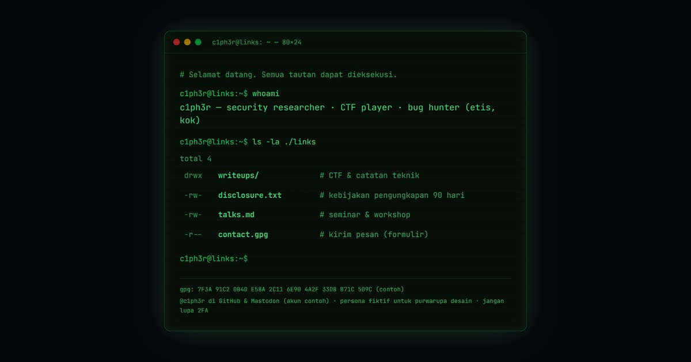

# c1ph3r — Security Researcher & Pemain CTF

Tautan c1ph3r, peneliti keamanan dan pemain CTF: writeup soal CTF, kebijakan pengungkapan 90 hari, jadwal seminar dan workshop, serta formulir kontak — dalam satu terminal.

**Demo live:** https://linkinbio-cipher.vercel.app



> Template link-in-bio dengan persona fiktif. Akun, klien, harga, dan jadwal hanya contoh; tautan utama menuju halaman dalam yang benar-benar ada, dan formulir tidak mengirim data.

## Konsep

Persona c1ph3r, security researcher. Terminal penuh: perintah `whoami` yang diketik, baris `ls -la` lengkap dengan bit izin, dan cahaya CRT.

## Halaman

- `/` — terminal CRT: ketikan whoami, daftar ls -la berbit izin; tautan tetap ada di HTML awal (tidak bergantung JavaScript)
- `/writeups` — empat writeup CTF fiktif dan kebijakan pengungkapan
- `/talks` — seminar & workshop Okt–Des 2026, formulir kontak bergaya perintah terminal

## Teknologi

- Next.js 15.5 (App Router) dan React 19
- Tailwind CSS v4
- JavaScript
- Font: JetBrains Mono (next/font)
- SEO: metadata per halaman, Open Graph, JSON-LD, sitemap.xml, dan robots.txt

## Menjalankan secara lokal

```bash
npm install
npm run dev
```

Buka http://localhost:3000. Untuk build produksi: `npm run build` lalu `npm start`.

---

Bagian dari koleksi 12 template link-in-bio di [PortalBio](https://www.pintuweb.com/link-in-bio). Dibuat oleh [PintuWeb](https://www.pintuweb.com), jasa pembuatan website.
